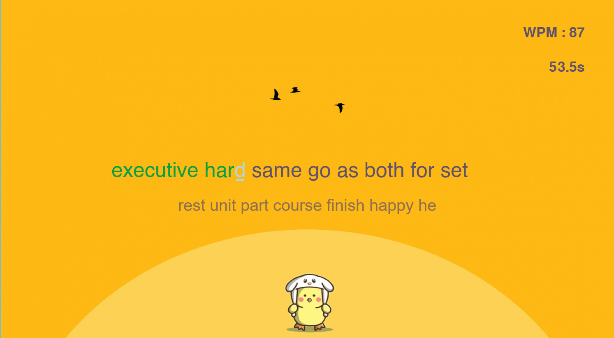

<a name="readme-top"></a>
[](https://github.com/julienbrs)
[![LinkedIn][linkedin-shield]][linkedin-url]

<!-- PROJECT LOGO -->
<br />
<div align="center">
  <a href="https://github.com/julienbrs/Typing-training">
    
  </a>

<h3 align="center">Typing-training</h3>

  </p>
</div>

<strong>Old project done in 2022</strong>

<!-- TABLE OF CONTENTS -->

<summary>Table of Contents</summary>
<ol>
<li>
    <a href="#about-the-project">About The Project</a>
</li>
<li>
    <a href="#getting-started">Getting Started</a>
    <ul>
    <li><a href="#prerequisites">Prerequisites</a></li>
    <li><a href="#installation">Installation</a></li>
    <li><a href="#usage">Usage</a></li>
    </ul>
</li>
<li><a href="#contact">Contact</a></li>
</ol>

<br />

<!-- ABOUT THE PROJECT -->

## About The Project

[](https://www.python.org/)
<br />

<p align="center">
  
</p>

The Typing Test is a game designed to test and improve your typing speed. Word are displayed, and you have to type as many words as possible in the limited timeframe. At the end, your words per minute (WPM) score is calculated and saved, helping you monitor and improve your typing speed over time.

  The graphical interface of this Typing Test was built using <strong>Pygame</strong>. While I wasn't initially familiar with Pygame, it was a rewarding experience to delve into it and see this project come to fruition.


<p align="right">(<a href="#readme-top">back to top</a>)</p>

<!-- GETTING STARTED -->

## Getting Started

To get a local copy up and running follow these simple example steps.

### Prerequisites

-   python
    ```sh
    sudo apt install python3
    ```

### Installation

1. Clone the repo
    ```sh
    git clone https://github.com/julienbrs/Typing-training.git
    ```
2. Rights to execute
    ```sh
    chmod +x src/main.py 
    ```
3. Then run the program, see more info about parameters in the [Usage](#usage) section
    ```sh
    ./src/main.py 
    ```

<p align="right">(<a href="#readme-top">back to top</a>)</p>

## Usage

Start the game by running the `main.py` script. Type as quickly and accurately as possible. After the test is complete, your WPM will be displayed. Challenge yourself to beat your own high score!

#### Configuration

You can configure the game by editing the `config.py` file. The following parameters are available:

-   `capital_letters`: if true, capital letters will be included in the test, otherwise all letters will be lowercase
-   `accents`: if true, accents will be included in the test
-   `punctuation`: if true, punctuation will be included in the test
-   `numbers`: if true, numbers will be included in the test
-   `time_of_test`: the duration of the test in seconds
-   `sound_volume`: the volume of the sound effects (0.0 to 1.0)

#### Custom word list

All words used in the test are stored in the `src/utils/dictionnary.txt` file. You can add or remove words from this file to customize the test. Each word should be on a separate line.

You can also add a batch of words by adding words into `src/utils/new_words.txt` file. Each word should be seperated by a space or 
a new line. Then run the `./src/utils/manage_dictionnary.py` script to add the words to the dictionnary. It will filter out any words that are already in the dictionnary and clean up the `new_words.txt` file.

#### Progress tracking

By saving your score at the end of each test, you can track your progress over time. Your scores are saved in the `src/classes/records.txt` file. Each line in the file represents a single test. A graph is also generated to visualize your progress at the
root of the project, named `wpm_progress.png`.

<p align="right">(<a href="#readme-top">back to top</a>)</p>

<!-- CONTACT -->

## Contact

Bourseau Julien - _Project done in 1st year at Ensimag, 2021/2022_ - julien.bourseau@gmail.com

Project Link: [https://github.com/julienbrs/Typing-training](https://github.com/julienbrs/Typing-training)

<p align="right">(<a href="#readme-top">back to top</a>)</p>

[linkedin-shield]: https://img.shields.io/badge/-LinkedIn-black.svg?style=for-the-badge&logo=linkedin&colorB=555
[linkedin-url]: https://www.linkedin.com/in/julien-bourseau-ba2239228
